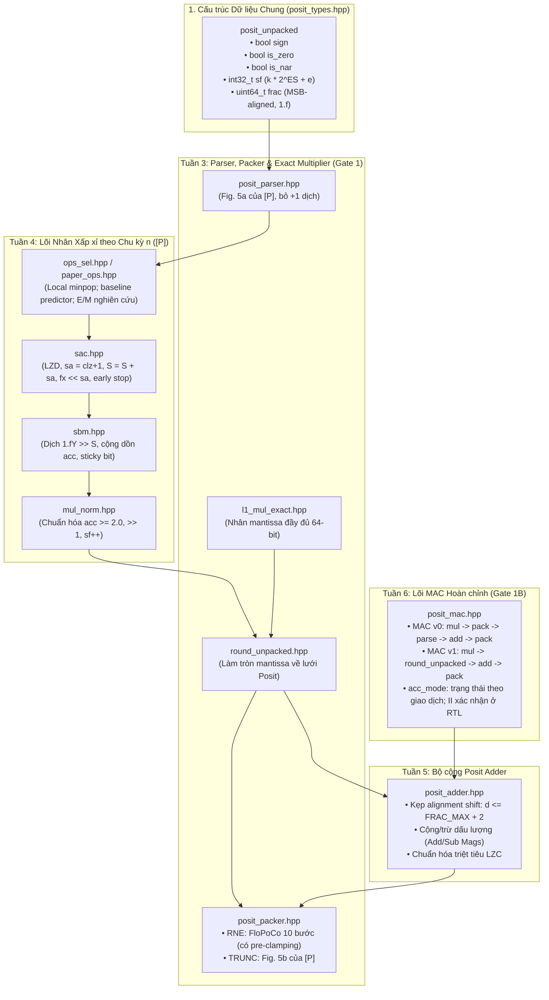

# Kế hoạch Triển khai Mô hình Thuật toán L1 (C++ Golden Model)

**Hợp đồng tích hợp cập nhật 06/10/2026 — SPEC v1.4:** RTL baseline v0/v1 giữ profile L1 normative: cfg_ops=0/1, cfg_n đếm fraction, hidden khởi tạo riêng; paper_source_config/predictor7-bit là nghiên cứu riêng. H là ngân sách hạng thanh ghi; không bubble thì L_valid=H-1, L_handshake=H (E0 là input handshake). n=0 dùng token init_only; core_done=q+2 cạnh sau OPS launch, q=max(1,n), last chỉ hoàn tất ở accumulator. Top rst_n đồng bộ dùng reset bridge/startup barrier để phối hợp leaf reset_n và nhận A/B/C nguyên tử. Đây là hợp đồng triển khai, chưa nghiệm thu core/bridge/MAC RTL. Chi tiết và trạng thái tại [SPEC §4–§5 và §11](../SPEC_Posit_MAC_IP.md). Bước tiếp theo: packer tuần8, rồi core và tích hợp; chồng lấn sau baseline.

> **Mục tiêu**: Xây dựng mô hình thuật toán C++ L1 (`l1/`) mô phỏng trung thực 100% từng bước biến đổi dữ liệu của vi kiến trúc phần cứng Posit MAC, tham số hóa theo `template <int NB, int ES, int FRAC_W>`, đóng vai trò làm thước đo chân lý bit-exact (AC-01) cho RTL SystemVerilog, vượt qua các cổng kiểm chuẩn nghiêm ngặt **Gate 1 (Tuần 3)** và **Gate 1B (Tuần 6)** theo [SPEC_Posit_MAC_IP.md](../SPEC_Posit_MAC_IP.md).

---

## 1. Bối cảnh và Nguyên tắc Cốt lõi của L1

### 1.1 Khắc phục rủi ro "Sai lệch nhận thức hệ thống" (Systematic Bias)
Do mô hình thuật toán L1 (C++) và RTL (SystemVerilog) đều do cùng tác giả phát triển, nguy cơ lớn nhất là tác giả hiểu sai lý thuyết và hiện thực cái sai đó lên cả hai nơi. Khi đó RTL khớp L1 100% nhưng cả hai đều sai so với chuẩn toán học Posit.
* **Nguyên tắc bắt buộc**: Mọi module của L1 ở chế độ exact **bắt buộc phải qua kiểm định chéo và đạt 0 mismatch tuyệt đối so với L0 (SoftPosit)** trước khi được dùng để kiểm chứng RTL.

### 1.2 Hỗ trợ đa cấu hình (Cấu hình Chuẩn vs Cấu hình Bài báo [P])
* **Cấu hình chuẩn SoftPosit**: `posit8 (ES=0)`, `posit16 (ES=1)`, `posit32 (ES=2)`.
* **Cấu hình bài báo [P]**: `posit32 (ES=3, FRAC_W=12)` (SoftPosit không có sẵn `ES=3`).
* **Giải pháp kiến trúc**: L1 được thiết kế dưới dạng C++ Template tổng quát `template <int NB, int ES, int FRAC_W>`. Khi chạy ở `ES=0, 1, 2`, L1 đối chiếu bit-exact với SoftPosit (L0). Sau khi được chứng minh đúng đắn 100%, L1 chạy ở `ES=3` sẽ là chân lý chuẩn mực để kiểm chứng RTL cho bài báo [P].

---

## 2. Các Quyết định Kỹ thuật

> [!IMPORTANT]
> **Phân kỳ thực hiện theo Tuần (Tuần 3 $\rightarrow$ Tuần 6)**:
> Mặc dù kế hoạch kiến trúc tổng thể L1 được lập toàn diện ngay tại đây, đề tài tuân thủ chặt chẽ tiến độ từng tuần của Đồ án 2:
> - **Giai đoạn 1 (Tuần 3 - Gate 1)**: Tập trung hoàn thiện `posit_parser`, `posit_packer`, `round_unpacked` và bộ nhân Exact `l1_mul` $\rightarrow$ Nghiệm thu **Gate 1** (0 mismatch với L0).
> - **Giai đoạn 2 (Tuần 4)**: Triển khai `ops_sel`, `sac`, `sbm` (vòng lặp $n$ xấp xỉ), tái hiện **TV-PAPER-01** (Fig. 4) và Bảng Table I của [P].
> - **Giai đoạn 3 (Tuần 5)**: Triển khai bộ cộng Posit Adder `l1_add` (kẹp cứng alignment shifter, LZC cancellation).
> - **Giai đoạn 4 (Tuần 6 - Gate 1B)**: Ghép nối hoàn chỉnh lõi MAC `l1_mac` (MAC v0, v1, `round_unpacked`, `acc_mode`) $\rightarrow$ Nghiệm thu **Gate 1B** trước khi code RTL ở Tuần 7.

> [!TIP]
> **Cấu trúc Thư viện Header-Only**:
> L1 sẽ được tổ chức dưới dạng thư viện C++ **Header-Only** (`l1/include/`). Cách tiếp cận này giúp:
> 1. Trình biên dịch C++ tự động tối ưu hóa inline hóa tối đa khi chạy hàng trăm triệu vector.
> 2. Dễ dàng tích hợp vào Verilator harness (Đường A) qua DPI-C mà không gặp lỗi liên kết thư viện tĩnh/động.
> 3. Đi kèm wrapper C (`l1_api.h` / `l1_api.cpp`) để Python có thể gọi trực tiếp qua `ctypes` tương tự như L0.

---

## 3. Kiến trúc Cấu trúc Dữ liệu & Các Module L1



---

## 4. Đặc tả Chi tiết Từng Module L1

### 4.1 Cấu trúc Unpacked (`l1/include/posit_types.hpp`)
```cpp
template <int NB, int ES>
struct posit_unpacked {
    bool sign;           // 0: dương, 1: âm
    bool is_zero;        // Cờ nhận diện số 0
    bool is_nar;         // Cờ nhận diện NaR
    int32_t sf;          // Scale factor gộp: sf = k * 2^ES + e
    uint64_t frac;       // Mantissa căn MSB: bit cao nhất là hidden bit 1.f
    bool exact;          // Không còn đuôi số học; false cung cấp sticky cho packer
};
```

### 4.2 Module Parser (`l1/include/posit_parser.hpp`)
* **Thuật toán theo §5.2 của SPEC (Khớp Fig. 5a của [P], bỏ +1 trong lượng dịch)**:
  1. Trích xuất $s = p[NB-1]$.
  2. Bù hai: $t_1 = s \text{ ? } (\sim p + 1) : p$. Phát hiện $p = 0 \implies \text{is\_zero}$, $p = 0x80..0 \implies \text{is\_nar}$.
  3. $r = t_1[NB-2]$ (bit regime đầu).
  4. Đếm số bit liên tiếp giống $r$ trong $t_1[NB-3:0]$ bằng LOD/LZD $\rightarrow cnt \in [0, NB-2]$.
  5. Tính toán $Rgm$ bằng XNOR bù hai: $Rgm = \sim (\{0, cnt\} \oplus \{(r)\})$. Nếu $r=1 \implies k = cnt$; nếu $r=0 \implies k = -(cnt+1) = -m$.
  6. Payload RTL: $t_2 = t_1[NB-4:0] \ll cnt$, trong vector rộng `NB-3` bit; đã loại regime và terminator. Cách L1 tương đương: lấy `NB-2` bit sau FRB, dịch `cnt` trong độ rộng đó rồi dịch cố định thêm 1 để bỏ terminator; nếu `cnt=NB-2` thì payload bằng 0. Không lấy exponent ngay sau phép dịch `cnt` của cách L1 vì terminator vẫn còn ở MSB.
  7. Trích xuất $e = t_2 \text{ lấy } ES \text{ bit MSB}$; $sf = k \times 2^{ES} + e$ (C++ dùng phép nhân, không dịch trái k âm).
  8. Trích xuất $frac = \{1'b1, t_2 \text{ bỏ } ES \text{ bit}\}$, căn sát MSB 64-bit.

**RTL tuần7:** chốt parser tổ hợp theo hợp đồng SPEC §5.2 trước, nghiệm thu bit-exact với L1 và decoder trường độc lập trên ModelSim rồi mới thêm pipeline. RTL xuất fraction không chứa hidden bit; L1 chứa hidden bit ở vị trí63, cần quy đổi khi đối chiếu. Detector được chọn `vld=0` phải trả `cnt=NB-2`, không dùng trực tiếp `K=0`.

**Nghiệm thu tổ hợp 05/10/2026:** `posit_parser_comb.sv` và testbench đạt 2.465.812 lượt trên ModelSim, 0 mismatch; posit8/16 vét cạn, posit32 ES2/ES3 mỗi format 1.200.010 mẫu, seed20261005. Chi tiết tái chạy và log xem `rtl/README.md`, `results/parser_comb/`.

**Nghiệm thu pipeline 05/10/2026:** `posit_parser.sv` hai tầng elastic đạt toàn bộ 2.465.812 fixture trên ModelSim, 0 mismatch; cả bốn format kiểm reset/startup/flush, stall dài, sức chứa hai slot, bubble, handshake đồng thời và thứ tự/không mất/không nhân đôi giao dịch. Cạnh input E0 → output valid sau E1 → output handshake sớm nhất E2, II=1 khi không stall. Reset leaf `reset_n` assert bất đồng bộ/deassert qua hai FF theo Guidelines; reset top `rst_n` theo SPEC; hợp đồng bridge/startup barrier hiện chốt tại §4.2, RTL tích hợp chưa triển khai. Vivado2026.1 compile/elaborate đạt; chưa tổng hợp/STA. Tuần7 hoàn thành phạm vi đơn vị, chưa phải Gate2/3. Bước tiếp theo là RTL packer/RNE tuần8 rồi kiểm parser→packer. Lệnh, coverage và hash tại `rtl/README.md` mục5, `results/parser_pipeline/`.

**Tinh chỉnh06/10/2026:** chuyển tạo Rgm sang P2 theo Fig.5(a), P1 giữ cnt/FRB thay cho cnt/k. Giảm5 bit thanh ghi RTL mỗi parser NB32; ModelSim2.465.812 fixture và reset/stall/latency/II kiểm lại đạt,0 mismatch. Vivado compile/elaborate đạt, tổng hợp so FF/LUT bị chặn do thiếu license nên chưa công bố lợi ích PPA. Không ảnh hưởng nghiệm thu tuần7 hoặc thứ tự tiếp theo tuần8.

### 4.3 Module Packer (`l1/include/posit_packer.hpp`)
* **Chế độ RNE (FloPoCo 10 bước có pre-clamping, §5.9-A)**:
  1. Xử lý NaR $\rightarrow 0x80..0$, Zero $\rightarrow 0x00..0$.
  2. **Tiền kẹp (Pre-clamping)**: $SF\_MAX = (NB - 2) \ll ES$. Nếu $sf \ge SF\_MAX \implies$ bão hòa về `maxpos`; nếu $sf \le -SF\_MAX \implies$ bão hòa về `minpos`.
  3. Tách $expF = sf \ \& \ ((1 \ll ES) - 1)$, $regF = sf \gg ES$, $rc = (sf < 0)$. Nếu $rc \implies regF = -regF$.
  4. Ghép vector `inshift` và xác định `offset = rc ? (regF - 1) : regF`.
  5. Dịch phải số học: `ansshf = inshift >> offset`.
  6. Trích xuất $\{anstmp, LSB, G, R, S\}$ (với $S$ là cây OR gom các bit dư).
  7. Làm tròn: $round = G \ \& \ (LSB \mid R \mid S)$, $mag\_rounded = anstmp + round$.
  8. Áp dụng dấu: $R = sign \text{ ? } (-mag\_rounded) : mag\_rounded$.
* **Chế độ TRUNC (Fig. 5b của [P], §5.9-B)**:
  * Cắt cụt trực tiếp không làm tròn, phục vụ tái hiện chính xác số liệu PPA và độ chính xác của bài báo gốc.

### 4.4 Module `round_unpacked.hpp` (§5.9-C)
* **Ý nghĩa sống còn cho MAC v1 Non-fused**:
  * Khi tích $A \times B$ hoàn tất, thay vì phải chạy qua `posit_pack` thành bitstring rồi gọi `posit_parser` giải mã lại (tốn 2 chu kỳ trễ vô ích), khối `round_unpacked` thực hiện làm tròn mantissa tích ngay trên miền unpacked theo số bit fraction khả dụng của $sf_{\text{mul}}$.
  * Cắt bỏ toàn bộ bit dư dưới lưới Posit. Đảm bảo tích $P$ đưa vào Adder hoàn toàn sạch bit dư, giữ đúng ngữ nghĩa Non-fused 2 lần làm tròn, đạt **bit-exact 100% với hàm tách rời `p<N>_add(p<N>_mul(a, b), c)` của SoftPosit**.

### 4.5 Module OPS (`l1/include/ops_sel.hpp`)
* Thực hiện chính sách chọn toán hạng:
  * `cfg_ops = 0`: $X = A, Y = B$.
  * `cfg_ops = 1`: Đếm số bit 1 bằng `popcount(fracA)` và `popcount(fracB)`. Toán hạng nào ít bit 1 hơn được chọn làm $X$ (điều khiển số vòng lặp SAC), toán hạng còn lại làm $Y$ (bị dịch trong SBM). Giảm số vòng để vét hết fraction; không bảo đảm sai số nhỏ hơn ở cùng n. Chỉ đếm fraction thực dùng sau cắt/pad; hòa chọn A; cfg_ops=2/3 bị từ chối.
  * Tính $sign_o = s_A \oplus s_B$, $sf_o = sf_A + sf_B$.

### 4.6 Module SAC (`l1/include/sac.hpp`) và SBM (`l1/include/sbm.hpp`)
* Hợp đồng triển khai theo SPEC v1.4 §5.5–5.7; mô hình C++ mô tả từng bước số học, chưa chứng minh timing FSM/RTL.
* Nạp acc=1.fY trước vòng lặp (đóng góp hidden bit X). Với n=0 trả đóng góp này.
* Mỗi bước chọn bit 1 đầu tiên: sa=clz(fx)+1, S+=sa, fx=(fx<<sa) & mask(W), acc+=Y>>S. Dừng khi fx=0 hoặc đạt n.
* Approximate dùng FRAC_W bit fraction cao; FLOOR cắt từng số hạng về FRAC_W (G/R bằng 0), STICKY_ACC giữ thêm hai bit G/R và OR các đuôi dịch vào sticky. Hai scheme độc lập EXACT_EN.
* Exact dùng đầy đủ FRAC_MAX, acc có 2*FRAC_MAX bit fraction và hai bit nguyên, không giới hạn bởi N_MAX. Chuẩn hóa tích >=2 đúng một lần rồi pack RNE/TRUNC.
* fx=0 chỉ nghĩa đã vét hết fraction X được chọn. IterResult lưu iterations, remaining_fx, approx_cut, input_cut, inexact và saturated riêng; unpacked.exact chỉ phản ánh đuôi số học SBM/normalize, không dùng để báo hoàn thành SAC.
* Trace gồm sa, S, fx, acc và sticky sau từng bước. TV-PAPER-01 FLOOR n=2 có sa=2/3, S=2/5, acc=0x168a/0x171a; vòng lặp hoàn tất nhưng inexact=true.

### 4.7 Module Bộ cộng Posit Adder (`l1/include/posit_adder.hpp`)
* **Thuật toán theo §5.8**:
  1. Tính chênh lệch scale factor: $d = sf_1 - sf_2$ (giả sử $sf_1 \ge sf_2$).
  2. **Kẹp cứng Alignment Shifter**: $d_{clamp} = \min(d, \text{FRAC\_MAX} + 2)$. Nếu $d > \text{FRAC\_MAX} + 2$, dồn toàn bộ $m_2$ vào bit sticky $S$.
  3. Dịch căn chỉnh mantissa $m_2 \gg d_{clamp}$.
  4. Thực hiện phép cộng/trừ dấu lượng (Add/Sub Magnitudes).
  5. Nếu trừ hai số gần bằng nhau: Dò số 0 đầu bằng LZC (Leading Zero Counter), dịch trái phục hồi chuẩn hóa và trừ bù tương ứng vào scale factor $sf$.

---

## 5. Kế hoạch Triển khai Chi tiết và Phân kỳ

### Giai đoạn 1 (Tuần 3) — Khởi đầu L1 & Nghiệm thu Gate 1
* **Mục tiêu**: Xây dựng nền tảng Parser, Packer, Round Unpacked và Bộ nhân Exact. Đạt chuẩn Gate 1.
* **Các file tạo mới**:
  1. `l1/include/posit_types.hpp`: Định nghĩa kiểu dữ liệu unpacked và config template.
  2. `l1/include/posit_parser.hpp`: Thuật toán Parser Fig. 5a.
  3. `l1/include/posit_packer.hpp`: Thuật toán Packer RNE (FloPoCo 10 bước) và TRUNC.
  4. `l1/include/round_unpacked.hpp`: Làm tròn mantissa trên miền unpacked.
  5. `l1/include/l1_multiplier_exact.hpp`: Lõi nhân mantissa 64-bit đầy đủ.
  6. `l1/test/test_identity.cpp`: Kiểm chứng vòng khép kín $\text{pack}(\text{parse}(p)) \equiv p$.
  7. `l1/test/test_mul_exact.cpp`: Đối chiếu `l1_mul` exact vs SoftPosit `p<N>_mul`.
  8. `l1/Makefile`: Biên dịch các test suite L1 trên cả Windows và Linux.
* **Tiêu chí nghiệm thu Gate 1**:
  - Identity test: 100% Pass trên $2^8 = 256$ posit8 và $2^{16} = 65,536$ posit16.
  - Multiplier exact: 0 mismatch với SoftPosit trên $2^{16}$ cặp posit8, $2^{32}$ cặp posit16, toàn bộ Corner List (§6.4) và $\ge 10^7$ vector phân tầng posit32.

### Giai đoạn 2 (Tuần 4) — Lõi Nhân Xấp xỉ theo Chu kỳ n & Tái hiện Bài báo [P]
* **Mục tiêu**: Xây dựng OPS, SAC, SBM, FSM lặp; tái hiện thực nghiệm bài báo gốc.
* **Các file tạo mới**:
  1. `l1/include/ops_sel.hpp`: OPS min-popcount của profile local; `paper_ops.hpp`: predictor n=2/7-bit baseline và tùy chọn E/M.
  2. `l1/include/sac.hpp`: Shift Amount Calculator + LZD + Early Termination.
  3. `l1/include/sbm.hpp`: Shift-Based Multiplier + Accumulator + Sticky bit.
  4. `l1/include/mul_norm.hpp`: Chuẩn hóa tích.
  5. `l1/include/l1_multiplier_iter.hpp`: Bộ nhân lặp hoàn chỉnh tham số hóa $n \in [0, N\_MAX]$.
  6. `l1/test/test_tv_paper.cpp`: Kiểm chứng TV-PAPER-01 (Fig. 4 của [P]).
  7. `l1/test/test_table1_reproduce.cpp`: Khảo sát profile local n=1..6; `test_paper_table1.cpp`: bộ đo FP32 chính thức cho baseline/relative n=2..4, tiêu chí sai lệch <=1 điểm phần trăm.

**Cập nhật 04/10/2026:** các header và test tuần 4 đã triển khai. TV-ITER/TV-PAPER và oracle bit-position approximate đạt; nhánh iterative exact đối chiếu L0 cho ES=0/1/2, đối chiếu nhân rộng cho ES=3. Đây chưa phải chạy lại toàn miền posit16/posit32 phân tầng cho nhánh iterative mới.
Thống kê 10 triệu cặp mỗi n=1..6 đã chạy theo hai phân bố ghi rõ trong README/log. Chưa đạt ngưỡng Table I ≤1 điểm phần trăm; tuần 4 vẫn processing. Không điều chỉnh thuật toán normative chỉ để ép khớp số liệu. Lệnh make test_table1 trả lỗi nếu chưa đạt; chạy test_table1_reproduce không có --require-match chỉ xác nhận thí nghiệm chạy xong.

### Giai đoạn 3 (Tuần 5) — Bộ cộng Posit Adder (`l1_add`)
* **Mục tiêu**: Hoàn thành mô hình thuật toán bộ cộng chuẩn bị cho MAC.
* **Các file tạo mới**:
  1. `l1/include/posit_adder.hpp`: Alignment shifter clamping + Add/Sub Mags + LZC cancellation.
  2. `l1/test/test_adder.cpp`: Đối chiếu bit-exact với SoftPosit `p<N>_add`.
* **Tiêu chí nghiệm thu**: 0 mismatch trên $2^{16}$ cặp posit8, $2^{32}$ cặp posit16, corner list và $\ge 10^7$ vector posit32.


**Nghiệm thu 04/10/2026:** posit_adder.hpp và test_adder.cpp đã triển khai. Posit8/16 vét cạn 65.536/4.294.967.296 cặp và posit32 ES2 phân tầng 10 triệu khớp SoftPosit, 0 mismatch. ES3 kiểm 10 triệu bằng oracle integer rộng, không gọi là đối chuẩn L0 ES3. Cả4 format có corner/ties/clamp/cancellation; >=30% near-opposite và mọi polarity/run hữu hạn >=10.000 operands. Linux/Windows/UBSan smoke 3.468.043 đối chiếu/nền tảng, regression đạt; Windows có thêm 10 triệu ES2/ES3. Full suite Linux 4.316.435.339 đối chiếu đạt. Tuần 5 hoàn thành; Gate 1B vẫn chờ MAC tuần 6. Xem README mục 12, results/week5_adder_* và make test-adder-acceptance.

### Giai đoạn 4 (Tuần 6) — Lõi Posit MAC Hoàn chỉnh & Nghiệm thu Gate 1B
* **Mục tiêu**: Ghép nối hoàn chỉnh MAC v0, MAC v1 (Non-fused), và `acc_mode`. Đạt chuẩn Gate 1B.
* **Các file tạo mới**:
  1. `l1/include/posit_mac.hpp`: Luồng tính toán MAC tích hợp Non-fused và tích lũy chuỗi.
  2. `l1/src/l1_api.cpp` / `l1/include/l1_api.h`: Cung cấp hàm DPI-C và ctypes (`l1_p32_mul`, `l1_p32_mac`).
  3. `l1/test/test_mac_gate1b.cpp`: Kịch bản nghiệm thu Cổng Gate 1B đối chiếu `p<N>_add(p<N>_mul(a,b), c)`.
* **Tiêu chí nghiệm thu Gate 1B**: 0 mismatch trên $2^{24}$ bộ ba posit8, corner list và $\ge 10^7$ vector phân tầng posit32.

**Nghiệm thu 04/10/2026 — ✅:** MAC v0/v1 non-fused, exact/approx, RNE/TRUNC, metadata và trạng thái `acc_mode/acc_clr` đã triển khai. Gate1B Linux/Windows đều đạt 36.841.216 đối chiếu: toàn bộ 2^24 bộ ba posit8, 10 triệu posit32 ES2 với L0 và 10 triệu ES3 với oracle integer riêng, corner/state; 0 mismatch, coverage đạt SPEC §6.3. ES3 không được gọi là đối chuẩn SoftPosit. API C/DPI scalar/ctypes và client C đạt Linux/Windows; UBSan và regression đạt. Xem README mục15, logs `results/week6_*`. Tuần6 hoàn thành về mô hình số học; handshake, pipeline, backpressure và II còn phải kiểm ở RTL.

### Giai đoạn Mở rộng (Tuần 11–12, Tier 3) — Mô hình Thuật toán Fused MAC (`l1_mac_fused`, §5.12 SPEC)
* **Mục tiêu**: Hiện thực kiến trúc MAC v2 Fused (1 lần làm tròn, gộp toán hạng $C$ vào Accumulator SBM có dấu, độ rộng `ACC_WIN = FRAC_MAX + 6 = 33` bit cho Posit32).
* **Các file tạo mới**:
  1. `l1/include/posit_mac_fused.hpp`: Căn chỉnh theo $\Delta SF$, chọn mốc Tích/C, phát số hạng vòng 0, trừ có mượn sticky (§5.12-c), hậu xử lý ABS/LZC và chuẩn hóa.
  2. `l1/test/test_mac_fused.cpp`: Kiểm chứng TV-FUSE-01, TV-FUSE-02, các vector biên $|\Delta SF| = \text{FRAC\_MAX} + 2, 3$, triệt tiêu chính xác/gần đúng; đối chuẩn bit-exact với `p8_mulAdd` trên $2^{24}$ vector posit8.
* **Vị trí lộ trình**: Nằm ngoài đường găng Gate 1..Gate 3, phục vụ mở rộng Tier 3 và làm chuẩn đối chiếu cho RTL MAC v2 ở Tuần 13–14.

---

## 6. Kế hoạch Kiểm thử & Đối chiếu Tự động (Verification Plan)

| Test Suite | Lệnh thực thi | Mục tiêu xác minh | Ngưỡng Pass bắt buộc |
| :--- | :---| :---| :---: |
| **Identity Roundtrip** | `make -C l1 test_identity` | $\text{pack}(\text{parse}(p)) \equiv p$ | $100\%$ Pass trên mọi bitstring hợp lệ (p8, p16) |
| **Exact Mul Gate 1** | `make -C l1 test_mul_exact` | Đối chiếu L1 exact với SoftPosit L0 | **0 mismatch tuyệt đối** ($2^{16}$ p8, corner list, $10^7$ p32) |
| **TV-PAPER-01 Test** | `make -C l1 test_tv_paper` | Kiểm tra từng chu kỳ của Fig. 4 [P] | Khớp chính xác $S=2, S=5$, tích mantissa kết thúc sau 2 vòng lặp |
| **Table I Baseline / E/M** | `make -C l1 paper-table1` / `paper-table1-relative` | Bộ đo chính thức FP32, 200 triệu accepted, bốn ngưỡng; ghi riêng profile | <=1 điểm % so Proposed; baseline chưa đạt, E/M đã đạt trong generator địa phương |
| **Adder Exact** | `make -C l1 test_adder` | Đối chiếu `l1_add` với `p<N>_add` | **0 mismatch tuyệt đối** |
| **MAC Gate 1B** | `make -C l1 test_mac_gate1b` | Đối chiếu MAC v0/v1 với SoftPosit | **0 mismatch tuyệt đối** ($2^{24}$ p8, corner list, $10^7$ p32) |
| **Fused MAC (Tier 3)** | `make -C l1 test_mac_fused` | Đối chiếu `l1_mac_fused` với `p8_mulAdd` | **0 mismatch tuyệt đối** ($2^{24}$ p8 exhaustive, TV-FUSE-01/02) |

## Cập nhật thực nghiệm baseline + cải tiến — 04/10/2026

Đã hoàn thành các bước triển khai/kiểm chứng theo quy trình baseline trước, biến thể sau:
1. `paper_multiplier.hpp`: RND có dấu, complement và n đếm tổng số hạng; ví dụ [15] và Fig.4 [P] đã kiểm.
2. OPS predictor n=2/7-bit tái dựng; tie-A là giả định; 128-entry truth table đã kiểm độc lập.
3. Generator [0,1) uniform-value grid24, oracle FP32 RNE, chính sách loại zero được ghi; paper chưa cung cấp seed/phân bố chi tiết.
4. 200 triệu cặp/hàng: max lệch Kim [15] 0,942710 điểm %, Proposed [P] 1,352910 điểm %; chưa đạt tiêu chí Proposed <=1 điểm %, không đánh dấu tuần 4 hoàn thành.
5. Cùng dữ liệu chỉ thay OPS min-popcount; ModelSim 116.384 cặp và Quartus ba seed/policy trên EP4CE22F17C6. Cây cân bằng giảm LUT4 73->63, nhưng register 15->25; fmax range chồng lấn và độ chính xác ngưỡng chặt giảm.

Nguồn đầy đủ/giả định/log/lệnh: README mục 6, SPEC phụ lục B/C, `results/paper_table1_200m.log` và `results/ops_ppa_summary.csv`. Không coi khảo sát OPS riêng là Gate 2 hoặc kết quả full MAC. Khóa các giả định còn lại trước khi mở rộng RTL.

### Bước 2 OPS đã tách và vét cạn — 04/10/2026

`paper_ops.hpp` cung cấp predictor cố định n=2/7-bit và tiền xử lý FP32 normal cắt 11 bit, giữ 12 bit fraction; predictor chỉ nhận 7 bit cao. `PaperMultiplier` dùng chung module; không đổi bảng hay RND/SBM. `test_paper_ops` kiểm 33.587.337 đối chiếu Linux/Windows/UBSan, gồm toàn bộ fraction23 và 4096x4096 cặp OPS, tie và n-independence. FP32 special classification có bypass/preserve payload, chưa là full IEEE multiply. Xem README mục 7 và log `paper_ops_step2_*.log`.

### Bước 3 bộ đo đã tách và kiểm chứng — 04/10/2026

`paper_measurement.hpp` khóa generator FP32 [0,1), seed/PRNG, oracle RNE trước cắt, thứ tự lọc và counters; so bốn ngưỡng bằng số nguyên chính xác. Suite 1.900.058 đối chiếu Linux/Windows/UBSan đạt, gồm oracle integer độc lập một triệu tích và ties tại ngưỡng. Replay/Linux/Windows khớp 100.000 accepted cho cả hai phân bố về tỷ lệ, counters và fingerprint. Xem README mục 8 và logs paper_measurement_step3. Bước 3 chức năng hoàn thành; lần 200 triệu trước là lịch sử, cần chạy lại bộ đo mới để nghiệm thu Table I. Tuần 4 giữ processing.

### Bước 4 chạy lại 200 triệu đã hoàn tất — 04/10/2026

Bộ đo bước 3 chạy seed 314159/grid24 trên 200.000.000 accepted (attempted=200.000.023, zero loại 23), fingerprint b4c229e09c0ec0ba. Các hàng trùng lịch sử ở độ chính xác log; max Proposed=1,352910 điểm %, max Kim=0,942710. --require-match trả 1 đúng vì chưa đạt Proposed <=1 điểm %. Xem README mục 9 và results/paper_table1_step4_*. Tuần 4 vẫn processing; ưu tiên khảo sát các giả định tái dựng còn mở và độ nhạy seed, ghi rõ nguyên nhân chưa được xác định.

### Khảo sát giả định và seed đã hoàn tất — 04/10/2026

Công cụ nghiên cứu test_paper_sensitivity kiểm một yếu tố mỗi lượt, 7 profile x 5 seed x 10 triệu accepted/hàng. Baseline max Proposed 1,337120–1,372450 điểm %; tie/pack không giải quyết sai lệch, guard12 có ảnh hưởng nhưng chưa đạt. Relative predictor E/M đạt <=1 trên 5 pilot seed; xác nhận seed mới 271828/200 triệu cho max 0,976696 điểm %, baseline cùng corpus 1,347652. Self-test Linux/Windows/UBSan 1.500.128 đối chiếu đạt; smoke cross-platform khớp. Xem README mục 10, paper_sensitivity_* logs/CSV/hash. Baseline/RTL giữ nguyên và tuần 4 processing: kết quả của biến thể không chứng minh LUT gốc. Bước tiếp theo có căn cứ là đưa relative_prediction thành tùy chọn nghiên cứu được kiểm chứng và đo chi phí comparator/PPA trước khi chọn cải tiến cuối.

### Tích hợp E/M và nghiệm thu profile L1 đã đạt — 04/10/2026

API paper_ops_select_relative<W>, PaperOps::PredictN2Relative và --profile relative đã tích hợp; mặc định/enum cũ/cfg_ops normative giữ nguyên. 35.503.586 đối chiếu Linux/Windows/UBSan đạt; make test đạt; smoke mặc định không đổi, relative cross-platform khớp. Target make paper-table1-relative chạy 200 triệu accepted seed271828: PASS/exit0, max Proposed 0,976696 điểm %, output khớp công cụ khảo sát. Xem README mục 11 và paper_relative_integration_* logs/CSV/hash.

Đã hoàn thành phần tích hợp, kiểm chứng và nghiệm thu số học của tùy chọn E/M. Tuần4 giữ processing vì yêu cầu tái hiện baseline hiện hành còn chưa đạt; không đánh đồng biến thể đạt ngưỡng với chứng minh LUT gốc. Đo PPA E/M phục vụ lựa chọn cải tiến sau đó, không bổ sung thành điều kiện bắt buộc của tuần4 L1.


### Đối chiếu [18] và ưu tiên khóa baseline — 04/10/2026

Đã đọc toàn bộ bản Babić 2010 vừa tải và đối chiếu [15]/[P]; bản được trích dẫn là 2011, chưa có toàn văn tương ứng. Recurrence hai toán hạng/CT và audit 65.025 cặp dương 8-bit được ghi ở README mục13; AE khớp Table4, một ô Table3 còn lệch0,1 điểm %. Không dùng kết quả này để đóng TableI FP32.

Ưu tiên baseline tiếp theo: kiểm cách căn accumulator theo exponent số hạng đầu l1 trong [15] §3.3. Mô hình hiện căn theo scale đầu vào; fixture p1=1 cho khác biệt khi cắt từng số hạng. Khảo sát anchor-first riêng, đối chiếu trace p1=0/1, oracle và nhiều độ rộng, rồi đo cùng corpus/seed trước khi quyết định sửa baseline. Chưa xác nhận đây là nguyên nhân sai lệch. Full LUT n2/tie, width và generator vẫn mở; E/M giữ vai trò cải tiến. Tuần4 processing và tuần5 đã nghiệm thu được giữ nguyên.


### Danh sách ưu tiên hoàn thiện baseline gốc — rà soát 04/10/2026

Mục tiêu: tái dựng đúng thuật toán Proposed từ [15]/[P] với provenance, sau đó đánh giá tái hiện Table I. Ngưỡng <=1 điểm % là tiêu chí số học của dự án; không đủ để khẳng định thuật toán/LUT gốc. E/M là cải tiến riêng. Các mục dưới là kế hoạch, chưa triển khai trong lần rà soát này.

| Ưu tiên | Công việc tiếp theo | Kiểm chứng / điều kiện kết thúc | Trạng thái |
| --- | --- | --- | --- |
| 1 | Khảo sát anchor-first theo [15] §3.3: p1 làm mốc, shift=pj−p1; giữ OPS tuyệt đối, SAC complement và các yếu tố khác | Oracle dyadic/số nguyên độc lập; directed p1=0/1, ngưỡng1,5, phần dư0, số hạng âm và shift lớn; đối chiếu fixture6144/4096, ví dụ [15], Fig.4; log riêng, không đổi default trước kiểm chứng | ✅ |
| 2 | Tách ảnh hưởng mốc căn và độ rộng/cắt accumulator | So scale-input/anchor-first với cùng width; sau đó quét guard0/1/2/12, giữ input Q12. Xác định cắt ở từng số hạng hay sau cộng và đuôi âm. Đối chiếu oracle giữ đủ precision; đánh dấu width chưa được nguồn công bố, không chọn cấu hình chỉ vì khớp bảng | processing |
| 3 | Kiểm predictor theo bảng mẫu [15], không chỉ oracle cùng recurrence | Truy vết các pattern RD/RU, số hạng và lỗi dự đoán; phân biệt lỗi trên mantissa với score E/M, 7-bit complement và điểm cắt. Vét cạn128 prefix, kiểm low5/tie riêng; nếu không suy ra được LUT duy nhất thì giữ nhãn tái dựng và liệt kê entry/giả định còn mở | processing |
| 4 | Đối chiếu đường Kim FP32 và Proposed Posit trên cùng cặp đầu vào | Theo dõi trước/sau cut11, conversion FP32→Posit, m>15, scale, normalize và pack; tách sai số cắt đầu vào, approximation và output. Có reference Kim riêng cùng thuật toán/corpus để xác định gap từ core hay chuyển định dạng; không lấy cột Kim làm chuẩn của Proposed | ✅ |
| 5 | Pilot và xác nhận Table I cho ứng viên có căn cứ | Pilot nhiều seed trên corpus dùng chung; baseline hiện tại làm control, báo đủ12 ô n2/3/4, max gap và paired differences. Chỉ chạy200 triệu seed holdout khi ứng viên đã qua kiểm chứng; ghi compiler/hash/seed/lệnh/filters/fingerprint. Không đổi seed/tie/pack để ép khớp | ✅ |
| 6 | Hoàn thiện provenance và giới hạn tái hiện | Đối chiếu toàn văn bản Babić2011 nếu tiếp cận được; tìm code/LUT hoặc mô tả generator từ nguồn tác giả. Chốt cái nào nguồn công bố, cái nào suy ra, cái nào giả định. Khi nguồn không đủ, công bố baseline tái dựng có giới hạn thay vì khẳng định bit-exact gốc | processing |
| 7 | Comparator Babic FP32 riêng để bổ sung đủ ba cột Table I | Làm sau ưu tiên core Proposed; recurrence integer đã audit, nhưng mở rộng FP32/cut/normalize phải theo [15]/bản2011. Giải trình ô Table3 integer còn lệch0,1 điểm %. Không đưa recurrence hai toán hạng vào core Proposed | ✅ |

Thứ tự thực hiện: 1→2→3→4→5; truy tìm nguồn mục6 có thể làm song song về mặt công việc. Mục7 bổ sung độ đầy đủ của bảng so sánh, không phải điều kiện để sửa core Proposed. Chưa mở PPA E/M hoặc tối ưu RTL như một cách giải quyết sai lệch baseline. Không cần chạy lại các nghiệm thu parser/adder/SoftPosit dài khi các khối đó không đổi; chạy regression liên quan nếu sửa mã nguồn.

Tuần4 chỉ được đóng khi ứng viên có kiểm chứng chức năng, giả định/provenance đầy đủ và kết quả đo đạt tiêu chí đã chốt; nếu vẫn thiếu nguồn gốc thì phải ghi rõ giới hạn tái dựng. Tuần5 đã đạt và tiến độ MAC tuần6 được giữ riêng.

### Kết quả thực hiện ưu tiên baseline — 04/10/2026

Mục1: anchor-first đã triển khai/kiểm oracle; riêng anchor/guard chưa đạt. Mục2: đã quét guard0/1/2/12 và post-sum cut, kiểm oracle Q96/Q64; width gốc chưa xác minh. Mục3:2.097.282 đối chiếu tám fixture Table2/all don't-care tails,128 prefix/Fig2 đạt; prefix7 zero-extended trước complement tạo2 entry126/127 khác, nhưng chưa có full LUT n2/tie tác giả.

Mục4:200 triệu paired FP32/Posit, conversion/cut input không khác,12 tỷ lệ giống ở6 chữ số; source maxKim0,801969. Mục5:source_config đã tích hợp và29.878.945 đối chiếu Linux/Windows/UBSan đạt, regression đạt; bộ đo chính thức200 triệu seed271828 PASS maxProposed0,984213, legacy baseline/relative không đổi. Pilot5seed max0,970200–1,006150, hai seed vượt1; không công bố mọi seed đạt.

Mục6:PDF Babic2011 từ tác giả trảHTTP403; chưa tìm code/LUT/generator gốc. Tìm thấy publication2024 trên trang tác giả, chưa đọc full và chưa dùng thay baseline2021. Mục7:comparator Babic FP32 riêng200 triệu cùngcorpus PASS max0,009091 điểm %.

TableI baseline tái dựng đã đạt tiêu chí số học; xác minh baseline gốc vẫn processing ở LUT/width/provenance. Giữ default cũ và cfg_ops normative; source là profile có tên/lệnh rõ ràng để review. README mục14 và results/paper_source_* chứa bằng chứng. Không tự coi tuần4 hoàn thành về nguồn gốc, không thay tiến độ tuần5/6.
